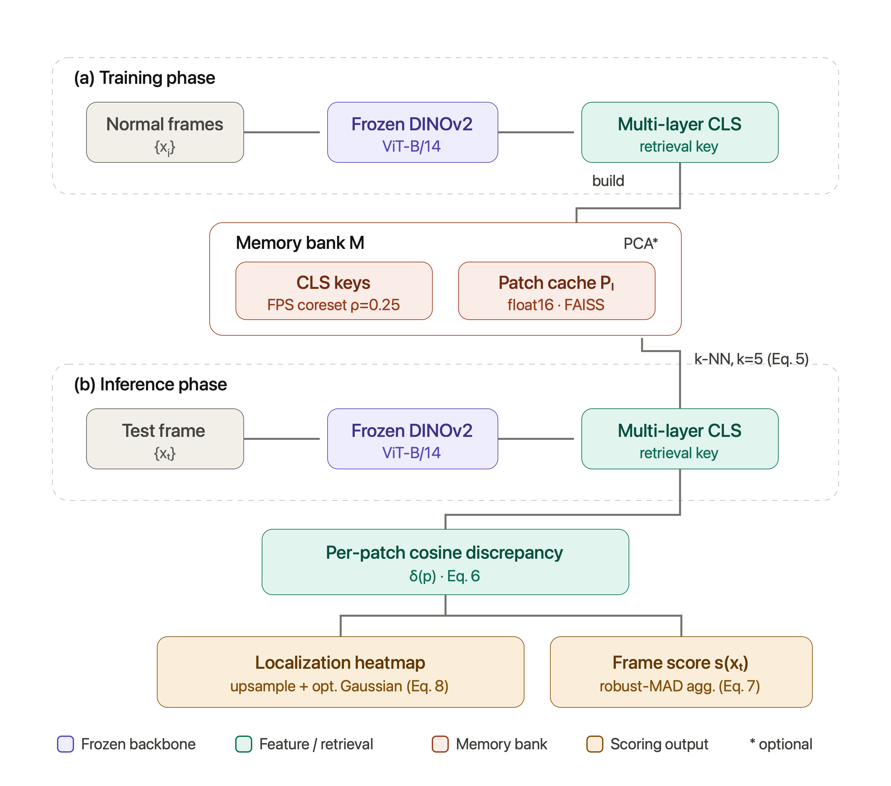

# MemoViT

**MemoViT: Training-Free Aerial Anomaly Detection and Localisation via a Frozen DINOv2 Multi-Layer CLS Memory Bank and k-NN Patch Discrepancy**

Manoj Kumar Balwant¹², Rajiv Misra¹
¹ Dept. of Computer Science and Engineering, Indian Institute of Technology Patna, India
² Dept. of Computer Science, UP Rajarshi Tandon Open University, Prayagraj, India

<!-- Add when available: paper link, arXiv, DOI, license badge -->
[](LICENSE)

---

MemoViT is a **training-free, one-class** framework that repurposes a **frozen DINOv2 ViT-B/14** backbone for zero-shot anomaly **detection and localization** in aerial imagery, without any fine-tuning or anomalous examples. It concatenates the class (CLS) tokens of the final five transformer blocks (ℓ ∈ {7, 8, 9, 10, 11}) into a hierarchical **retrieval key**, stores these keys together with last-block patch tokens in a non-parametric **memory bank** built from normal frames only, and at inference derives both a frame-level score and a pixel-level heatmap from **per-patch cosine discrepancy** against the *k* = 5 retrieved normal neighbours.

> The CLS descriptor serves **only** as the nearest-neighbour retrieval key. Both reported outputs — the localization heatmap and the frame/image score — are derived from the per-patch discrepancy field; the reported frame score is its robust median-absolute-deviation (MAD) aggregation. See [`scoring.py`](scoring.py) and [`REPRODUCIBILITY.md`](REPRODUCIBILITY.md).

## Highlights

- **No training, no labels, no anomalies.** Deploying on a new scene is a forward pass plus index construction.
- **Single frozen backbone** (`vit_base_patch14_dinov2`, via `timm`) shared across all five benchmarks.
- **One discrepancy mechanism** produces both detection and localization.
- **Scalable:** greedy farthest-point sampling (FPS, ρ = 0.25), optional exact-SVD PCA of the CLS key, float16 patch caching, and FAISS `IndexFlatIP` exact cosine retrieval.

## Reported results (from the paper)

| Benchmark | Headline metric | MemoViT |
|---|---|---|
| Drone-Anomaly (Railway) | Frame AUC | 0.990 |
| UIT-ADrone | Frame AUC | 0.858 |
| VisA | Mean AUPRO | 0.972 |
| MVTec-AD | Mean AUPRO | 0.986 |

Full per-scene / per-class / per-category tables and ablations are in the paper. MemoViT establishes state-of-the-art localization (AUPRO) among training-free methods and strong aerial frame-level detection, while remaining competitive (not leading) at industrial image-level AUROC.

## Method



*(a) Training:* frozen backbone → multi-layer CLS retrieval key → optional exact-SVD PCA → greedy FPS → float16 last-block patch cache → FAISS cosine index.
*(b) Inference:* build key → retrieve *k* = 5 neighbours → per-patch cosine discrepancy → heatmap (localization) + robust-MAD aggregation (frame score).

## Installation

```bash
git clone https://github.com/manojbalwant/MemoViT.git
cd MemoViT
conda create -n memovit python=3.10 -y
conda activate memovit
pip install -r requirements.txt
```

FAISS is installed via pip (`faiss-cpu`) by default. For GPU retrieval, install `faiss-gpu` matching your CUDA build instead. The reference environment used PyTorch 1.12.1 / CUDA 10.2; any recent PyTorch with a `timm` that ships DINOv2 weights (≥ 0.9.2) will work.

## Datasets

MemoViT evaluates on five public benchmarks. Download each from its original source and set the corresponding path in the configuration block at the top of the relevant script.

| Benchmark | Domain | Source |
|---|---|---|
| Drone-Anomaly | Aerial video | Jin et al., IEEE TGRS 2022 |
| UIT-ADrone | Aerial traffic video | Tran et al., IEEE JSTARS 2023 |
| Agriculture-Vision 2021 | Multispectral remote sensing | Chiu et al., CVPR 2020 |
| VisA | Industrial inspection | Zou et al., ECCV 2022 |
| MVTec-AD | Industrial inspection | Bergmann et al., CVPR 2019 |

All inputs are resized to **518 × 518** (P = 1,369 patch tokens). See [`REPRODUCIBILITY.md`](REPRODUCIBILITY.md) for the exact per-benchmark preprocessing, normalization, and post-processing settings.

## Repository structure

```
MemoViT/
├── README.md
├── REPRODUCIBILITY.md        # per-benchmark settings + known issues + checklist
├── run.py                    # unified CLI: dispatches to any benchmark pipeline
├── requirements.txt
├── CITATION.cff
├── LICENSE
├── scoring.py                # canonical reported scorer (robust-MAD, Eq. 7)
├── assets/
│   └── fig1_pipeline.png     # pipeline figure (add rendered image)
└── src/
    ├── scoring.py            # shared scorer, importable when running from src/
    ├── metrics.py            # shared metrics: AUROC, pixel-AUROC, AUPRO, EER (Eqs. 9-12)
    ├── aerial_memovit.py     # Drone-Anomaly / UIT-ADrone  (paper Tables 1–2, MemoViT)
    ├── baselines.py          # PatchCore / PaDiM / SimpleNet (paper Tables 1–2, baselines)
    ├── ablation.py           # ablation study               (paper Table 6)
    ├── mvtec_visa_memovit.py # MVTec-AD / VisA              (paper Tables 3–4, 7–8)
    └── agriculture_memovit.py# Agriculture-Vision           (paper Table 5)
```

`scoring.py` (Eq. 7) and `metrics.py` (Eqs. 9–12) are the shared, unit-tested modules; the per-benchmark scripts import the scorer from `scoring.py` so the reported metric has a single definition.

## Reproducing the paper

Each pipeline exposes a configuration block (`BenchmarkConfig` / `BaseConfig`) at the top; set dataset paths and output directories there before running. A single entry point dispatches to any benchmark:

```bash
python run.py drone                     # Drone-Anomaly       (Tables 1–2, MemoViT)
python run.py uitadrone                 # UIT-ADrone          (Tables 1–2, MemoViT)
python run.py baselines --method patchcore   # aerial PatchCore re-run (Tables 1–2)
python run.py mvtec                     # MVTec-AD / VisA     (Tables 3–4, 7–8)
python run.py agri                      # Agriculture-Vision  (Table 5)
python run.py ablation --run-all        # ablations           (Table 6)
```

Arguments after the benchmark name are forwarded to the underlying script. Equivalently, the scripts can still be invoked directly (e.g. `python src/aerial_memovit.py`).

Determinism: all scripts set seed 42 with `cudnn.deterministic=True`, `benchmark=False`. The ablation runner repeats over seeds `[42, 123, 7]` and reports mean ± std; it also runs paired Wilcoxon signed-rank tests across variants.

## Default configuration (all benchmarks)

| Component | Setting |
|---|---|
| Backbone | `vit_base_patch14_dinov2` (timm), frozen, head = `nn.Identity` |
| Patch size / embedding dim | 14 / d = 768 |
| Input resolution | 518 × 518 → P = 1,369 patch tokens (37 × 37) |
| Retrieval-key layers | ℓ ∈ {7, 8, 9, 10, 11}; block 11 post-LayerNorm |
| Coreset | greedy FPS, ρ = 0.25 |
| CLS-key PCA | optional, exact SVD, k = 512 (off by default for aerial / agri / industrial) |
| Patch cache | last-block tokens, raw d = 768, float16 |
| Retrieval | FAISS `IndexFlatIP`, cosine, k = 5 |
| Reported frame score | robust-MAD aggregation of patch discrepancy (Eq. 7) — see `scoring.py` |

Per-benchmark normalization and Gaussian smoothing differ; they are documented explicitly in [`REPRODUCIBILITY.md`](REPRODUCIBILITY.md).

## Citation

If you use MemoViT, please cite the paper (see [`CITATION.cff`](CITATION.cff)):

```bibtex
@article{balwant2025memovit,
  title   = {MemoViT: Training-Free Aerial Anomaly Detection and Localisation via a Frozen DINOv2 Multi-Layer CLS Memory Bank and k-NN Patch Discrepancy},
  author  = {Balwant, Manoj Kumar and Misra, Rajiv},
  journal = {Preprint submitted to Elsevier},
  year    = {2025}
}
```

## License

Released under the MIT License — see [`LICENSE`](LICENSE). (Choose a different license if your institution requires it; update `CITATION.cff` and this section accordingly.)

## Acknowledgements

This work builds on DINOv2 (Oquab et al., 2023) and the PatchCore line of memory-bank anomaly detection (Roth et al., 2022). We thank the maintainers of the Drone-Anomaly, UIT-ADrone, Agriculture-Vision, VisA, and MVTec-AD benchmarks.
